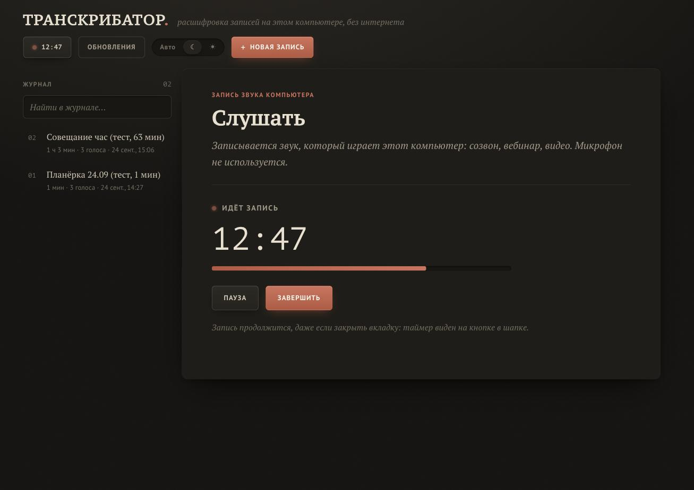

# Транскрибатор

Расшифровка аудио на русском с разделением по говорящим. Работает на вашем компьютере, без интернета, записи никуда
не отправляются. Можно загрузить файл с диктофона или записать звук, который играет компьютер, например созвон
или вебинар. На выходе стенограмма: кто, когда и что сказал.


<details><summary>Светлая тема</summary>


</details>

## Возможности

- Распознавание русской речи моделью Whisper large-v3. На чистой записи ошибок в словах около 2-3 %.
- Запись звука компьютера (кнопка «Слушать»): собеседники в Zoom, Teams или Telegram, вебинар, видео. Пишется звук
  устройства, микрофон не используется. Запись можно ставить на паузу, она сохраняется в журнал, её можно сразу
  расшифровать или скачать. Работает на macOS 14.2+ и Windows 10/11, подробнее [ниже](#запись-звука-компьютера).
- Разделение по говорящим, автоматически или по заданному числу людей. Имена вписываются прямо в стенограмму.
- Форматы: m4a с диктофона iPhone (AAC и ALAC), mp3, wav, ogg, opus, flac и видео (mp4, mov и другие).
- Длинные записи на час и больше. Они обрабатываются частями, разрезы идут по паузам, поэтому слова не теряются.
- Журнал всех расшифровок и записей с поиском и встроенным плеером. Клик по времени в стенограмме перематывает запись.
- Выгрузка стенограммы в TXT, с таймкодами и именами или без них.
- Тёмная и светлая темы, плюс режим «как в системе».
- После установки интернет не нужен. Модели и данные лежат в папке приложения.

## Системные требования

| | Минимум | Рекомендуется |
|---|---|---|
| Mac | Apple Silicon (M1 и новее), macOS 14+, 8 ГБ памяти | 16 ГБ памяти |
| Windows | 10/11 x64, 4 ядра, 8 ГБ памяти | видеокарта NVIDIA с 6 ГБ памяти, 16 ГБ ОЗУ |
| Диск | 3 ГБ | 6-8 ГБ |

Час записи расшифровывается примерно за 8-9 минут на Mac с M4 Pro (это замер), около 10 минут на ПК с современной
видеокартой NVIDIA и за 15-40 минут на процессоре без видеокарты с быстрой моделью. Подробности по памяти,
скорости на разных компьютерах и тому, что уже проверено, есть в [docs/REQUIREMENTS.md](docs/REQUIREMENTS.md).

## Установка

Пошаговая инструкция для macOS и Windows, через git и через ZIP, с решением проблем:
[docs/INSTALL.md](docs/INSTALL.md).

Через git (так приложение сможет обновляться кнопкой):
```bash
cd ~
git clone https://github.com/insideside/transkribator.git
cd transkribator
bash install.sh          # macOS / Linux
.\install.bat            # Windows, в Терминале (или двойной щелчок по install.bat)
```

Через ZIP: на странице репозитория Code > Download ZIP, распакуйте архив в домашнюю папку и запустите установщик
в папке `transkribator-main`. На Windows перед распаковкой откройте свойства архива и поставьте галочку
«Разблокировать», иначе Windows будет показывать предупреждения.

Установщик сам ставит Python, библиотеки, ffmpeg и модели (2-5 ГБ, от 5 до 20 минут), проверяет, что всё работает,
и создаёт ярлык. На Mac приложение появится в «Программах», на Windows на рабочем столе и в меню «Пуск».

Папку приложения лучше держать в домашней папке (`~/transkribator` или `C:\Users\<имя>\transkribator`).
Если «Документы» или «Рабочий стол» синхронизируются с iCloud или OneDrive, туда класть не стоит: в папке будут
гигабайты моделей и ваши записи.

## Как пользоваться

1. Запустите «Транскрибатор», в браузере откроется http://127.0.0.1:8770.
   На Windows появится свёрнутое окно «Transkribator», это сервер: закройте его, чтобы остановить приложение.
   На Mac значок висит в Dock, пока приложение работает, и останавливается через «Завершить».
2. Перетащите файлы в окно и выберите язык. Если знаете, сколько человек на записи, укажите это, так голоса
   разделятся точнее.
3. Нажмите «Расшифровать». Вкладку можно закрыть, обработка продолжится.
4. В готовой стенограмме имена вписываются в блоке «Действующие лица». Если один человек попал под два номера,
   дайте им одно имя, и реплики объединятся. Если голоса разделились неудачно, нажмите «Пересчитать с N голосами».
   «Скачать TXT» выгружает стенограмму целиком.

## Запись звука компьютера



Кнопка «Слушать» в шапке записывает то, что звучит на компьютере: собеседников в Zoom, Teams, Telegram, вебинар,
видео. Микрофон при этом не используется, поэтому ваш голос в запись не попадёт.

Нажмите «Начать запись», пойдёт таймер и индикатор уровня звука. Запись продолжается и с закрытой вкладкой, таймер
виден на кнопке в шапке и в виджете на рабочем столе. Пауза в запись не попадает. После «Завершить» запись
сохраняется в m4a и появляется в журнале с пометкой «не расшифровано». В том же окне её можно расшифровать
(язык, число голосов, модель), скачать или открыть в журнале.

| Система | Как пишется звук | Разрешение |
|---|---|---|
| macOS 14.2+ | Core Audio Process Tap через помощник «Транскрибатор Звук» | при первой записи macOS спросит разрешение на запись системного звука. Потом его можно поменять в Системных настройках: Конфиденциальность и безопасность > Запись экрана и системного звука |
| Windows 10/11 | WASAPI loopback устройства вывода по умолчанию (колонки или наушники) | не нужно |

Если сервер упадёт посреди записи, записанное сохранится при следующем запуске как «Восстановленная запись».

## Обновление

Если приложение установлено через `git clone`, обновляться можно кнопкой «Обновления» в шапке. Точка на ней значит,
что на GitHub вышла новая версия. В окне видно, что изменилось. Кнопка «Обновить» скачивает изменения, при
необходимости доустанавливает библиотеки и перезапускает приложение. Модели, журнал и записи остаются на месте.

Вручную: `git pull` в папке приложения, потом ещё раз установщик. Для ZIP скачайте новую версию, распакуйте поверх
старой и запустите установщик.

## Удаление

`uninstall.sh` (macOS, Linux) или `uninstall.bat` (Windows) удаляют ярлыки и виджет. После этого удалите папку
приложения вместе с моделями, журналом и записями. Больше приложение ничего в системе не оставляет.

## Где что хранится

| Папка | Что внутри |
|---|---|
| `models/` | модели распознавания и разделения по голосам |
| `data/history.sqlite3` | журнал расшифровок |
| `data/uploads/` | загруженные файлы и записи «Слушать», нужны для плеера и повторной обработки |
| `data/listen/` | временные файлы идущей записи, удаляются после сохранения |
| `data/logs/` | `app.log` с журналом работы и ошибок, `crash.log` с аварийными падениями |
| `settings.env` | локальные настройки, например `TRANSKRIBATOR_DEVICE=cpu` |

## Если что-то не работает

- Проверка установки: `.venv/bin/python -m app.selftest` на macOS и Linux, `.venv\Scripts\python.exe -m app.selftest` на Windows.
- Подробности ошибок пишутся в `data/logs/app.log`.
- Видеокарта NVIDIA не заработала. Приложение само переключается на процессор, если модель не загрузилась
  на видеокарту. Можно и принудительно: переустановить с `install.bat -Cpu` или вписать `TRANSKRIBATOR_DEVICE=cpu`
  в `settings.env`.
- Порт 8770 занят другой программой. Задайте свой порт в `settings.env`, например `TRANSKRIBATOR_PORT=8780`.
- macOS пишет, что не удаётся проверить разработчика. Запускайте установку командой `bash install.sh` в Терминале.
- «Слушать» не слышит звук. Проверьте, что на компьютере что-то играет. На macOS нужно разрешение на запись
  системного звука для «Транскрибатор Звук», на Windows звук должен идти на устройство вывода по умолчанию.
- Автоопределение нашло лишних говорящих. Укажите число людей при загрузке или нажмите «Пересчитать с N голосами».

## Как это устроено

| Этап | Технология |
|---|---|
| Декодирование аудио | ffmpeg из пакета [imageio-ffmpeg](https://github.com/imageio/imageio-ffmpeg) |
| Распознавание речи | [Whisper large-v3](https://github.com/openai/whisper): [MLX](https://github.com/ml-explore/mlx-examples) на Apple Silicon, [faster-whisper](https://github.com/SYSTRAN/faster-whisper) на Windows, Linux и Intel |
| Разделение по голосам | [sherpa-onnx](https://github.com/k2-fsa/sherpa-onnx): сегментация [pyannote 3.0](https://huggingface.co/pyannote/segmentation-3.0), голосовые отпечатки [3D-Speaker ERes2NetV2](https://github.com/modelscope/3D-Speaker) и своя кластеризация |
| Запись звука компьютера | macOS: Core Audio Process Tap, помощник на Swift в `macos-audiotap/`. Windows: WASAPI loopback через [PyAudioWPatch](https://github.com/s0d3s/PyAudioWPatch) |
| Сервер и интерфейс | FastAPI, SQLite, HTML/CSS/JS без сборки |

Длинные записи режутся на части примерно по 20 минут в самой тихой точке рядом с границей. Если часть не
обработалась, например не хватило памяти, она делится пополам и обрабатывается заново. Разделение по голосам
идёт параллельно с распознаванием, в отдельном процессе.

## Для разработчиков

```bash
uv sync                                   # окружение (https://docs.astral.sh/uv/)
uv run python -m app.models --all         # модели
uv run python run.py                      # сервер и браузер
uv run python -m app.selftest             # самопроверка
```

- Все компоненты интерфейса собраны на странице `/style-guide.html` запущенного приложения.
- CI в `.github/workflows/install-test.yml` проверяет установку и самопроверку на Windows, macOS и Linux.
- Иконки собираются командой `uv run --with pillow python assets/make_icons.py`.
- Замеры точности, скорости и памяти лежат в [docs/BENCHMARKS.md](docs/BENCHMARKS.md), замерить свой компьютер
  можно скриптом `scripts/benchmark.py`.

## Лицензии

Код проекта распространяется по лицензии [MIT](LICENSE). Используемые модели и библиотеки:

| Компонент | Лицензия |
|---|---|
| Whisper (модели OpenAI), MLX, mlx-whisper, faster-whisper, CTranslate2 | MIT |
| Модель сегментации pyannote segmentation-3.0 (ONNX-версия от sherpa-onnx) | MIT |
| 3D-Speaker ERes2NetV2, sherpa-onnx | Apache-2.0 |
| FFmpeg (через imageio-ffmpeg) | LGPL/GPL |
| PyAudioWPatch (запись звука на Windows) | Apache-2.0 |
| PortAudio (внутри PyAudioWPatch) | MIT-подобная |
| Шрифты PT Serif, PT Sans, PT Mono (в проект не входят, берутся из системы) | OFL |

Модели скачиваются установщиком из официальных источников (Hugging Face и релизы sherpa-onnx на GitHub),
в репозиторий они не входят.
