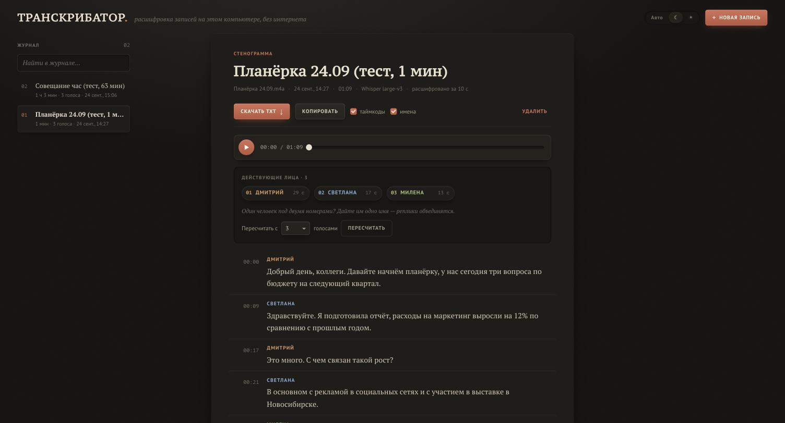
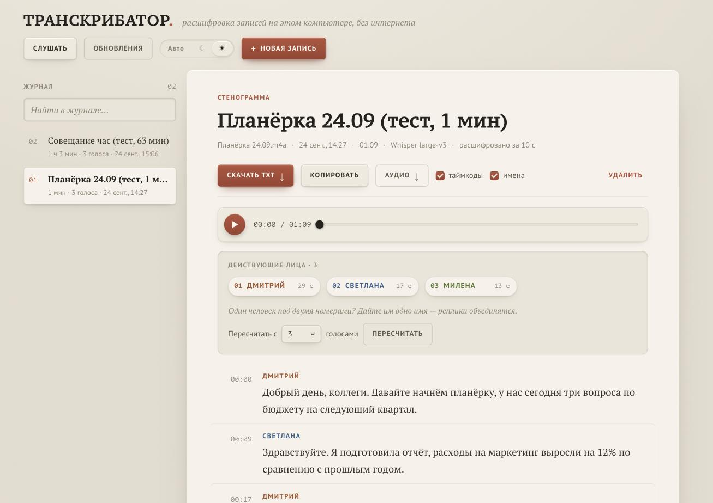

# Транскрибатор

**Локальная расшифровка аудио на русском с разделением по говорящим — и запись звука компьютера для неё.** Работает на вашем компьютере, без интернета
и без отправки записей куда-либо. Загружаете запись с диктофона — получаете стенограмму: кто, когда и что сказал.



<details><summary>Светлая тема</summary>


</details>

## Возможности

- **Точное распознавание русской речи** — модель Whisper large-v3 (ошибок в словах ≈ 2–3 % на чистой записи).
- **Разделение по говорящим** — автоматически или по заданному числу людей; имена можно вписать прямо в стенограмму.
- **Любые форматы:** m4a с диктофона iPhone (AAC и ALAC), mp3, wav, ogg, opus, flac, а также видео (mp4, mov…).
- **Длинные записи:** час и больше — обрабатываются частями, разрезы делаются в паузах, слова не теряются.
- **«Слушать» — запись звука, который играет компьютер** (созвон, вебинар, видео), а не микрофона: пауза,
  продолжение, сохранение в журнал, расшифровка и скачивание аудио из того же окна. macOS 14.2+ и Windows 10/11.
- **История** всех расшифровок и записей, поиск, встроенный плеер (клик по времени — перемотка).
- **Выгрузка в TXT** целиком — с таймкодами и именами или без.
- **Тёмная и светлая темы**, режим «как в системе».
- **Полностью офлайн** после установки. Все модели и данные хранятся в папке приложения.

## Системные требования

| | Минимум | Рекомендуется |
|---|---|---|
| **Mac** | Apple Silicon (M1+), macOS 14+, 8 ГБ памяти | 16 ГБ памяти |
| **Windows** | 10/11 x64, 4+ ядра, 8 ГБ памяти | видеокарта NVIDIA с 6+ ГБ, 16 ГБ памяти |
| **Диск** | ≈3 ГБ | ≈6–8 ГБ |

Час записи расшифровывается примерно за **8–9 минут** на Mac с M4 Pro (замер), **≈10 минут** на ПК с современной NVIDIA,
**15–40 минут** на процессоре без видеокарты (быстрая модель). Подробно — что нужно, сколько памяти и времени на разных
компьютерах, что проверено: **[docs/REQUIREMENTS.md](docs/REQUIREMENTS.md)**.

## Установка

📘 **Подробная пошаговая инструкция — [docs/INSTALL.md](docs/INSTALL.md)**: macOS и Windows, через git и через ZIP,
с картинкой того, что вы увидите, обновлением и решением проблем.

Коротко:

**Через git** (рекомендуется — тогда приложение обновляется кнопкой):
```bash
cd ~
git clone https://github.com/insideside/transkribator.git
cd transkribator
bash install.sh          # macOS / Linux
.\install.bat            # Windows (в Терминале) — или двойной щелчок по install.bat
```

**Через ZIP:** **Code → Download ZIP**, распаковать в домашнюю папку (Windows: сначала «Свойства → Разблокировать»,
потом «Извлечь все…»), затем в папке `transkribator-main` — `bash install.sh` (macOS) или двойной щелчок по `install.bat` (Windows).

Установщик сам ставит Python, библиотеки, ffmpeg и модели (≈2–5 ГБ, 5–20 минут), проверяет, что всё работает,
и создаёт ярлык: macOS — **«Транскрибатор» в Программах**, Windows — на **рабочем столе** и в **«Пуске»**.

> ⚠️ Кладите папку приложения в домашнюю папку (`~/transkribator`, `C:\Users\<имя>\transkribator`), а **не** в «Документы»
> или на «Рабочий стол», если они синхронизируются с iCloud или OneDrive: там будут гигабайты моделей и ваши записи.

## Как пользоваться

1. Запустите «Транскрибатор». Откроется браузер на **http://127.0.0.1:8770**.
   - На Windows появится свёрнутое окно «Transkribator» — это сервер. Закройте его, чтобы остановить приложение.
   - На macOS значок висит в Dock, пока приложение работает. «Завершить» в Dock его останавливает.
2. Перетащите файлы в окно и выберите язык и **сколько человек на записи** (если знаете — разделение будет точнее).
3. Нажмите **«Расшифровать»**. Вкладку можно закрыть, обработка продолжится.
4. В стенограмме:
   - **имена** вписываются прямо в «Действующих лицах»; если один человек попал под два номера, дайте им одно имя —
     реплики объединятся;
   - **«Пересчитать с N голосами»** — если автоматически голоса разделились неудачно;
   - **«Скачать TXT»** — вся стенограмма целиком.

## Запись звука компьютера («Слушать»)

Кнопка **«Слушать»** в шапке записывает то, что **звучит на компьютере**: собеседников в Zoom, Teams, Telegram,
вебинар, видео. Микрофон не используется — ваш собственный голос в запись не попадает (если нужен, включите
его воспроизведение в самой программе созвона).

1. **Начать запись** → идёт таймер и индикатор уровня звука. Запись продолжается, даже если закрыть вкладку:
   таймер виден на кнопке в шапке (и в виджете на рабочем столе).
2. **Пауза / Продолжить** — пауза в запись не попадает.
3. **Завершить** — запись сохраняется (AAC, m4a) и появляется в журнале как «не расшифровано».
   В том же окне: **Расшифровать** (язык, число голосов, модель), **Скачать аудио**, **Открыть в журнале**.

| Система | Как пишется | Разрешение |
|---|---|---|
| macOS 14.2+ | системный механизм Core Audio Process Tap через помощник «Транскрибатор — звук» | при первой записи macOS спросит **«Запись системного звука»** — нажмите «Разрешить». Изменить: Системные настройки → Конфиденциальность и безопасность → Запись экрана и системного звука |
| Windows 10/11 | WASAPI loopback устройства вывода по умолчанию (колонки/наушники) | не требуется |

Если сервер упадёт посреди записи, записанное не пропадёт: при следующем запуске оно сохранится в журнал
как «Восстановленная запись».

## Обновление

**Из приложения** (при установке через `git clone`): кнопка **«Обновления»** в шапке. Точка на ней означает, что на GitHub
появилась новая версия. В окне — список изменений; кнопка **«Обновить»** скачивает их, при необходимости доустанавливает
библиотеки и перезапускает приложение. Модели, история и записи не затрагиваются.

Вручную: `git pull` в папке приложения и затем установщик ещё раз. Для ZIP — скачать новую версию поверх и запустить установщик.
Уже скачанные модели и ваша история сохранятся.

## Удаление

Запустите `uninstall.sh` (macOS/Linux) или `uninstall.bat` (Windows) — они удалят ярлыки и виджет.
Затем удалите папку приложения: в ней модели, история и загруженные записи. Больше приложение ничего не оставляет.

## Где что хранится

| Папка | Что внутри |
|---|---|
| `models/` | модели распознавания и разделения по голосам |
| `data/history.sqlite3` | история расшифровок |
| `data/uploads/` | загруженные записи и записи «Слушать» (для плеера и повторной обработки) |
| `data/listen/` | временные файлы идущей записи (удаляются после сохранения) |
| `data/logs/` | `app.log` — журнал работы и ошибок; `crash.log` — аварийные падения |
| `settings.env` | локальные настройки установки (например, `TRANSKRIBATOR_DEVICE=cpu`) |

## Решение проблем

- **Проверить установку:** `.venv/bin/python -m app.selftest` (macOS/Linux) или `.venv\Scripts\python.exe -m app.selftest` (Windows).
- **Что-то пошло не так:** загляните в `data/logs/app.log` — там вся последовательность действий и ошибки.
- **Видеокарта NVIDIA не заработала:** переустановите с `install.bat -Cpu` или впишите `TRANSKRIBATOR_DEVICE=cpu` в `settings.env`.
  Приложение и само переключается на процессор, если модель не загрузилась на видеокарту.
- **Порт 8770 занят другим приложением:** задайте другой порт в `settings.env`, например `TRANSKRIBATOR_PORT=8780`.
- **macOS не открывает скрипт** («не удаётся проверить разработчика»): запускайте установку через `bash install.sh` в Терминале, как описано выше.
- **«Слушать»: звук не поступает:** проверьте, что на компьютере что-то играет; на macOS — разрешение «Запись системного звука» для «Транскрибатор — звук»; на Windows — что звук идёт на устройство вывода по умолчанию.
- **Автоопределение нашло лишних говорящих:** укажите точное число людей при загрузке или нажмите «Пересчитать с N голосами».

## Как это устроено

| Этап | Технология |
|---|---|
| Декодирование аудио | ffmpeg (пакет [imageio-ffmpeg](https://github.com/imageio/imageio-ffmpeg)) |
| Распознавание речи | [Whisper large-v3](https://github.com/openai/whisper): [MLX](https://github.com/ml-explore/mlx-examples) на Apple Silicon, [faster-whisper](https://github.com/SYSTRAN/faster-whisper) на Windows/Linux/Intel |
| Разделение по голосам | [sherpa-onnx](https://github.com/k2-fsa/sherpa-onnx): сегментация [pyannote 3.0](https://huggingface.co/pyannote/segmentation-3.0) + голосовые отпечатки [3D-Speaker ERes2NetV2](https://github.com/modelscope/3D-Speaker) + собственная кластеризация |
| Запись звука компьютера | macOS: Core Audio Process Tap (помощник на Swift, `macos-audiotap/`); Windows: WASAPI loopback ([PyAudioWPatch](https://github.com/s0d3s/PyAudioWPatch)) |
| Сервер и интерфейс | FastAPI, SQLite, HTML/CSS/JS без сборки |

Длинные записи режутся на части по ~20 минут в самой тихой точке рядом с границей. Если часть не обработалась
(например, не хватило памяти), она делится пополам и обрабатывается заново. Разделение по голосам идёт параллельно
с распознаванием, в отдельном процессе.

## Для разработчиков

```bash
uv sync                                   # окружение (uv: https://docs.astral.sh/uv/)
uv run python -m app.models --all         # модели
uv run python run.py                      # сервер + браузер
uv run python -m app.selftest             # самопроверка
```

- Компоненты интерфейса — страница `/style-guide.html` в запущенном приложении.
- CI: `.github/workflows/install-test.yml` проверяет установку и самопроверку на Windows, macOS и Linux.
- Иконки: `uv run --with pillow python assets/make_icons.py`.
- Замеры точности, скорости и памяти: [`docs/BENCHMARKS.md`](docs/BENCHMARKS.md); замер своего компьютера — `scripts/benchmark.py`.

## Лицензии

Код проекта — [MIT](LICENSE). Используемые модели и библиотеки:

| Компонент | Лицензия |
|---|---|
| Whisper (модели OpenAI), MLX, mlx-whisper, faster-whisper, CTranslate2 | MIT |
| Модель сегментации pyannote segmentation-3.0 (в формате ONNX от sherpa-onnx) | MIT |
| 3D-Speaker ERes2NetV2, sherpa-onnx | Apache-2.0 |
| FFmpeg (через imageio-ffmpeg) | LGPL/GPL |
| PyAudioWPatch (запись звука на Windows) | Apache-2.0 |
| PortAudio (внутри PyAudioWPatch) | MIT-подобная |
| Шрифты PT Serif / PT Sans / PT Mono (не входят в проект, берутся из системы) | OFL |

Модели скачиваются установщиком из официальных источников (Hugging Face, релизы sherpa-onnx на GitHub) и в репозиторий не входят.
